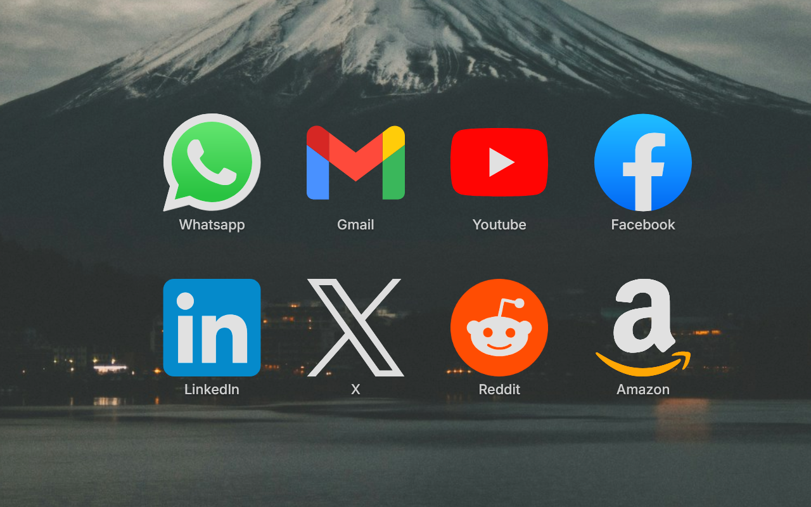

# New Tab

A fast, private new-tab page for Chrome. Open a tab and your shortcuts are
right there in a clean grid, arranged exactly the way you like them.

I built this because every new-tab page I tried was either cluttered with
things I don't use or too locked down to make my own. This one opens instantly,
shows the sites I actually visit, and gets out of the way.

## What it does

- **Your layout** — adjust icon size, spacing, and column count, and nudge the
  whole grid up or down so it sits nicely over your wallpaper.
- **Folders & pages** — group shortcuts into folders (drag a tile onto a folder
  to file it away) and spread them across multiple pages you flip through with
  the dots or arrow keys.
- **The right icon, every time** — favicons are fetched automatically, or pick
  from 1,800+ crisp icons in the open-source [dashboard icons](https://dashboardicons.com/)
  set, paste an image URL, or upload your own.
- **Sharp and instant** — icons are cached locally, so they load immediately
  and stay crisp on big 4K screens.
- **Themes** — one-click presets, plus full control over the accent color,
  background gradient, labels, and even your own custom CSS.
- **Your background** — a built-in gradient, a solid color, an image from the
  web, or one from your computer, with optional blur.
- **Your font** — keep the bundled one, choose a system font, upload a font
  file, or point it at a Google Font (downloaded once, then it works offline).
- **Keyboard launch** — assign the digits 1–9 to your favorite shortcuts and
  open them with a single keypress.
- **Native search** — an optional search bar, fully resizable and reshapable,
  that uses whatever search engine your browser already uses. No middleman.
- **Quality-of-life** — import a folder of bookmarks at once, right-click a tile
  for quick actions, launch your whole routine with "Open All", and back
  everything up to a file you can restore on another computer.

## Privacy

No tracking, no analytics, nothing phoned home. Your shortcuts and settings
live in your browser's local storage and nowhere else. The only time the
extension reaches the internet is to fetch a site's icon (which it then caches
locally so it won't ask again) or, if you choose the Google Fonts option, to
load that font. Nothing about you is ever collected or sent anywhere.

## Install

**From the Chrome Web Store:** search for "New Tab" or use the listing link.

**From source:**
1. Download or clone this repository.
2. Open `chrome://extensions` and turn on **Developer mode**.
3. Click **Load unpacked** and select the project folder.

## Built with

Plain HTML, CSS, and JavaScript — no build step, no frameworks. The
[Inter](https://rsms.me/inter/) font (SIL Open Font License) is bundled so the
page never depends on a font server. Icons courtesy of
[dashboard icons](https://dashboardicons.com/) (Apache-2.0).

## License

See [LICENSE](LICENSE).
